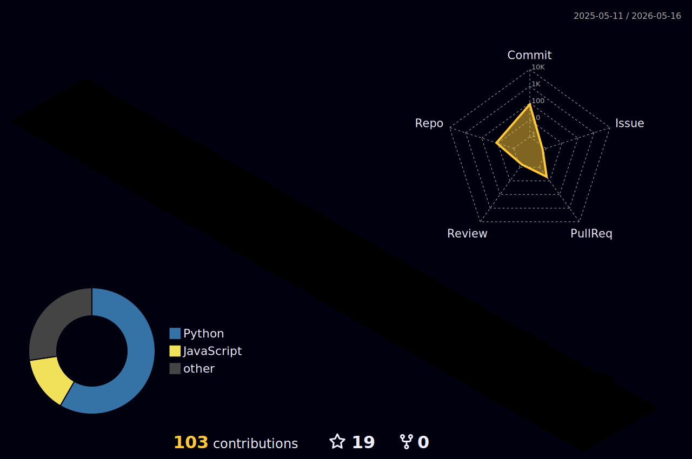

<!-- HEADER WAVE BANNER -->

<!-- NAME ANIMATION -->

 

---

 

<!-- TECH STACK -->

### ⚡ Tech Stack

 

#### 🧑‍💻 Languages

#### 🧩 Frameworks & Libraries

#### 🗄️ Databases & Cloud

#### 🛠️ Tools & Platforms

 

---

 

<!-- FEATURED PROJECTS -->

### 🚀 Featured Projects

 

&nbsp;

  

 

---

 

<!-- GITHUB TROPHIES -->

### 🏆 GitHub Trophies

 

 

---

 

<!-- GITHUB STATS -->

### 📊 GitHub Stats

 

&nbsp;

  

 

---

 

<!-- 3D CONTRIBUTION GRAPH -->

### 🧊 3D Contribution Calendar

 

<picture>
  <source media="(prefers-color-scheme: dark)" srcset="./profile-3d-contrib/profile-night-rainbow.svg" />
  <source media="(prefers-color-scheme: light)" srcset="./profile-3d-contrib/profile-green-animate.svg" />
  
</picture>

 

---

 

<!-- CONTRIBUTION GRAPH -->

### 📈 Contribution Graph

 

 

---

 

<!-- SNAKE ANIMATION -->

### 🐍 Watch My Contributions Get Eaten

 

<picture>
  <source media="(prefers-color-scheme: dark)" srcset="https://raw.githubusercontent.com/Ayushmansahoo098/Ayushmansahoo098/output/github-snake-dark.svg" />
  <source media="(prefers-color-scheme: light)" srcset="https://raw.githubusercontent.com/Ayushmansahoo098/Ayushmansahoo098/output/github-snake.svg" />
  
</picture>

 

---

 

<!-- SOCIAL LINKS -->

### 🌐 Let's Connect

 

&nbsp;

&nbsp;

&nbsp;

  

 

<!-- FOOTER WAVE -->

